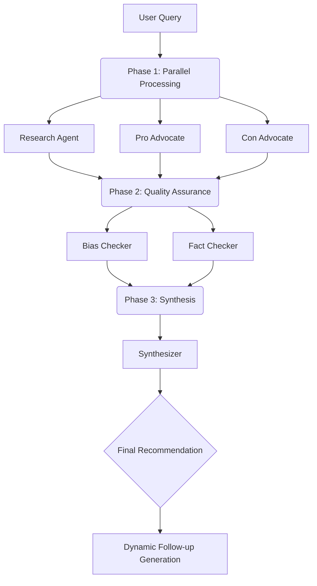

  <h1>🧠 NeuraMesh AI Research Studio</h1>
  
<strong>A Next-Generation Multi-Agent AI Research Platform</strong>

  
  

    
    
    
    
  

  

    <em>Analyze complex topics, brainstorm ideas, and interact with your proprietary documents using a swarm of specialized AI agents working in parallel.</em>
  

## 📑 Table of Contents

- [🌟 Key Features](#-key-features)
- [🗺️ Platform Navigation](#-platform-navigation)
- [🤖 The 6 AI Agents](#-the-6-ai-agents)
- [💻 Architecture & Flow](#-architecture--flow)
- [🛠️ Getting Started](#️-getting-started)
- [💡 Why NeuraMesh AI?](#-why-neuramesh-ai)

---

## 🌟 Key Features

| Feature | Description |
| :--- | :--- |
| **🚀 Ultra-Fast Agent Swarm** | Powered by the Groq API (`groq/compound-mini`), 6 specialized AI agents analyze your queries simultaneously for lightning-fast results. |
| **📚 RAG Knowledge Base** | Upload `.txt` and `.csv` files natively in your browser. Chat directly with your data using the dedicated Document Q&A interface. |
| **🧠 Conversational Memory** | The platform remembers your chat history, allowing for fluid, continuous, and natural follow-up conversations. |
| **🎯 Dynamic Follow-Ups** | The AI automatically generates highly relevant follow-up questions to help you dive deeper into any topic. |
| **✨ Structured Output** | Enjoy clean, highly scannable, and structured insights—no massive walls of text, just precise bullet points. |
| **🎨 Modern Dark UI** | A beautiful, distraction-free interface built with Tailwind CSS and Shadcn UI, featuring subtle animations. |

---

## 🗺️ Platform Navigation

Navigate through distinct, purpose-built hubs designed to optimize your workflow:

<b>🏠 Dashboard</b> <i>(Click to expand)</i>

<blockquote>The main control center. Enter your research queries, watch the AI swarm work in real-time, and engage in continuous follow-up conversations.</blockquote>

<b>🔍 Research Hub</b> <i>(Click to expand)</i>

<blockquote>A dedicated deep-dive area for exploring complex topics and reviewing comprehensive, multi-perspective findings.</blockquote>

<b>🌐 Agent Network</b> <i>(Click to expand)</i>

<blockquote>Visualize the underlying AI architecture. See exactly which specialized agents are active and understand their distinct roles.</blockquote>

<b>📚 Knowledge Base</b> <i>(Click to expand)</i>

<blockquote>The home for your proprietary data. Upload `.txt` and `.csv` files to securely extract text and chat directly with your own documents via the embedded Document Q&A chatbot.</blockquote>

<b>🕒 History & ⭐ Favorites</b> <i>(Click to expand)</i>

<blockquote>Your automated research log and personal bookmarking system for your most critical research outputs, allowing for instant retrieval.</blockquote>

---

## 🤖 The 6 AI Agents

Each agent has a distinct personality and purpose to ensure a holistic, unbiased analysis.

<b>Phase 1: Initial Analysis (Parallel)</b>

 

- **📊 Research Agent**: Objective facts, trends, and statistics.
- **💡 Pro Advocate**: Benefits, opportunities, and positive outcomes.
- **😈 Con Advocate**: Risks, downsides, and potential problems.

<b>Phase 2: Quality Assurance (Parallel)</b>

 

- **🎯 Bias Checker**: Identifies logical fallacies and cognitive biases in the arguments.
- **✅ Fact Checker**: Verifies claims and flags potential misinformation.

<b>Phase 3: Synthesis</b>

 

- **🎓 Synthesizer**: Creates the final balanced recommendation and overview, perfectly formatted in clear bullet points.

---

## 💻 Architecture & Flow

Curious how the swarm operates under the hood? Here is the lifecycle of a single query:

---

## 🛠️ Getting Started

Follow these steps to run NeuraMesh AI Research Studio locally on your machine.

### Prerequisites
- **Node.js** (v18 or higher)
- **Git**
- A valid **Groq API Key**

### Installation

**1. Clone the repository**
\`\`\`bash
git clone https://github.com/Rashmi-Pathak/NeuraMesh-AI.git
cd NeuraMesh-AI
\`\`\`

**2. Install dependencies**
\`\`\`bash
npm install
\`\`\`

**3. Configure Environment Variables**  
Create a \`.env\` file in the root directory and add your Groq API key:
\`\`\`env
VITE_GROQ_API_KEY=your_groq_api_key_here
\`\`\`

**4. Start the development server**
\`\`\`bash
npm run dev
\`\`\`
> 🌍 *Navigate to \`http://localhost:8080\` in your browser to start researching!*

---

## 💡 Why NeuraMesh AI?

Traditional decision-making and single-prompt AI chats often suffer from confirmation bias and a lack of diverse perspectives. 

**NeuraMesh AI solves this** by automatically forcing the consideration of both pro and con arguments simultaneously, verifying factual claims with dedicated agents, and allowing you to contextualize everything against your own proprietary documents in the RAG Knowledge Base.

 

  
Built with ❤️ for advanced AI research.

